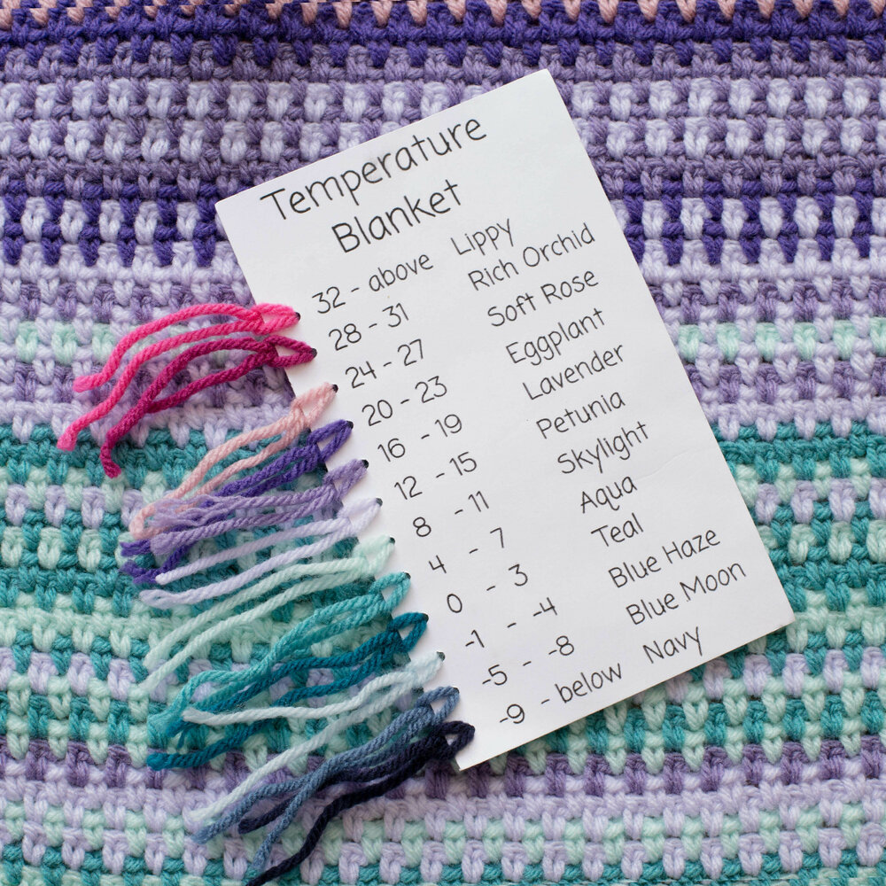
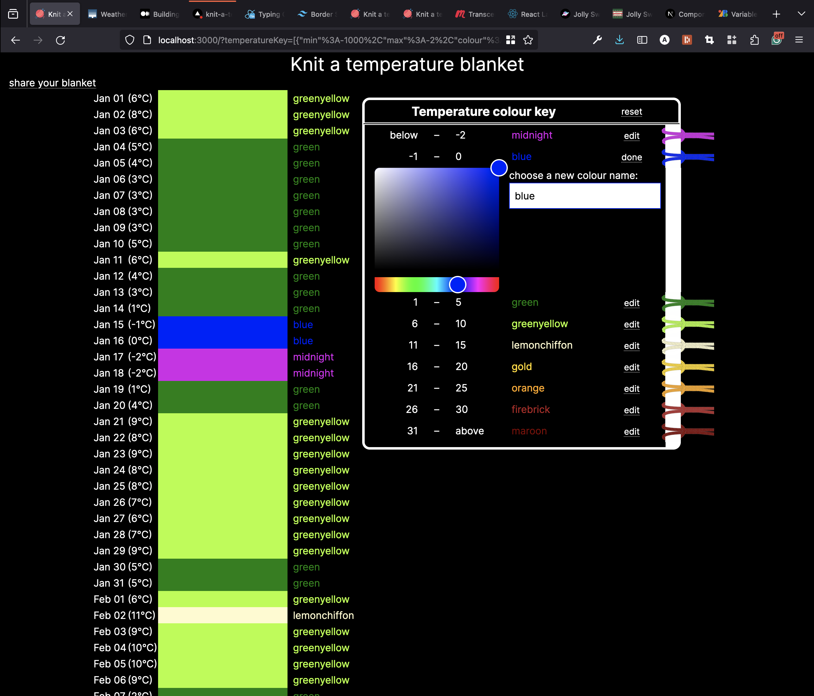
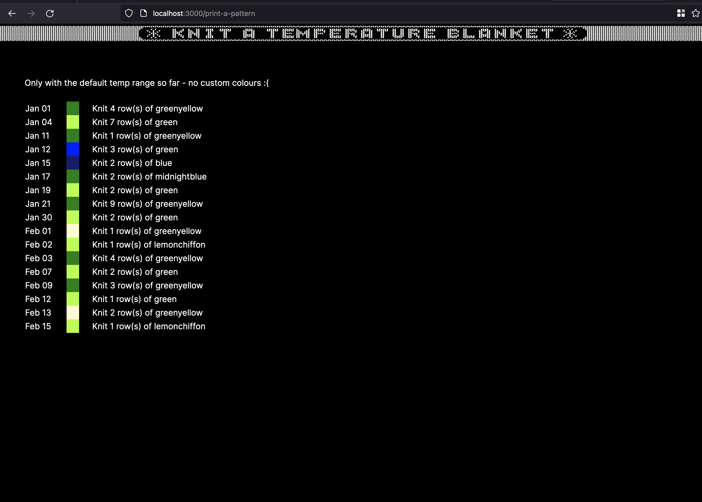
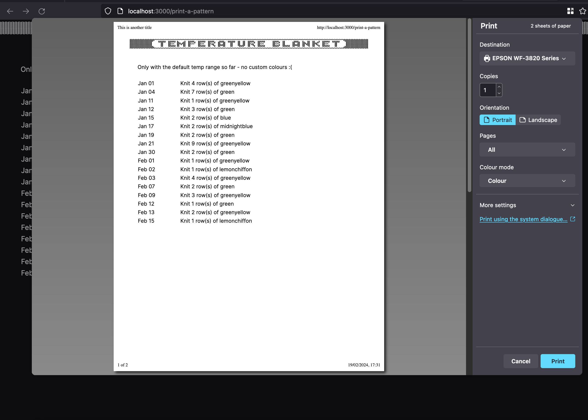

# knit-a-temperature-blanket

Generates a knitting pattern for a blanket with colours based on the recent temperature in your area. Built with Node v20.11.0




This is a [Next.js](https://nextjs.org/) project bootstrapped with [`create-next-app`](https://github.com/vercel/next.js/tree/canary/packages/create-next-app).

This is deployed on push to `main` using vercel at https://knit-a-temperature-blanket.vercel.app/


### Getting Started

To run the development server:

```bash
npm run dev
```

Open [http://localhost:3000](http://localhost:3000) with your browser to see the result.


## To do

- [x] CLI-based fixed calculator
- [x] Create react front end to display fixed text results
- [x] Host this front end for public access
- [ ] Key creator configuration
    - [x] Allow users to enter their own colours and names
    - [x] Get most current weather (no fixed date range)
    - [ ] Allow users to enter their own temperature ranges
    - [ ] Allow users to enter their own location to fetch weather from
    - [ ] Allow users to enter their own stitches per row e.g. knit 1 row, purl 1 row
    - [ ] Rainy day override
- [x] Share pattern with friends via URL
- [x] Save selected config to local storage for users to return to and refresh later in the year
- [x] Make pages responsive (mobile vs desktop)
- [x] Make fun header responsive
- [x] Make key creator a pretty visual experience i.e. UX to create the above pictured card key with yarn swatches.
- [x] Display pattern result alongside pretty colour visualisation of blanket
- [ ] Make pretty colour key frame a more reusable component to make other pretty keys e.g. location frame (will need to rework header and footer to be less grid locked to content :/)
- [x] Parse (don't validate) local storage and query param temperature keys
- [x] MVP printable knitting instructions
- [x] Export customisable knitting pattern to print
- [x] Share state between pages to allow custom patterns to be printed
- [ ] Add line of previous progress e.g. already knitted january, just focus on pattern for feb - march.
- [ ] About or home page explaining a temperature blanket
- [ ] Auto-generate temperature ranges based on previous years' data
- [ ] Make 'share' button nice
- [ ] Give more user feedback / instruction on creating sharable URL 
- [ ] Use some pretty icons for edit & reset colour range buttons


### Sneak Peek



#### Print a pattern

A printable version of the pattern (default colours only so far) is available at [/print-a-pattern](http://localhost:3000/print-a-pattern) 




#### Browser compatible

Fun and fancy header now responsive for browsers with different text-wrap compatibilities.


## Resources

This project was built with NextJS following the following guides:
- Get started with TypeScript https://www.typescriptlang.org/download
- Created tsconfig using `npx tsc --help``
- Start a new React Project https://react.dev/learn/start-a-new-react-project
- Next JS App Router https://nextjs.org/docs/app#are-there-any-comprehensive-open-source-applications-built-on-the-app-router
- Get started with NextJS https://nextjs.org/learn/dashboard-app/getting-started
- Weather API - OpenMeteo https://open-meteo.com/en/docs/historical-weather-api#latitude=53.9566&longitude=-1.0774&start_date=2024-01-01&end_date=2024-01-18&hourly=&daily=weather_code,temperature_2m_mean,daylight_duration,precipitation_sum&timezone=Europe%2FLondon
- When some git surgery was required https://gist.github.com/amalmurali47/77e8dc1f27c791729518701d2dec3680
- Deploying with Vercel https://nextjs.org/docs/deployment
- Vercel project dashboard: https://vercel.com/atraces-projects/knit-a-temperature-blanket
- Testing help https://echobind.com/post/how-to-mock-using-jest-spyon-part-2-3
- Getting started with jest and TS https://jestjs.io/docs/getting-started#using-typescript
- Refreshing flexbox https://flexboxfroggy.com/
- localStorage https://www.freecodecamp.org/news/how-to-use-localstorage-with-react-hooks-to-set-and-get-items/
- appending params to a current URL https://stackoverflow.com/a/69437235
- Using Tailwind CSS https://annadeveloper.medium.com/building-a-responsive-website-with-next-js-and-tailwind-css-from-scratch-4d7f7e9916fe
- React Context https://react.dev/learn/passing-data-deeply-with-context#step-1-create-the-context
- Typing React component props https://react-typescript-cheatsheet.netlify.app/docs/basic/getting-started/basic_type_example#useful-react-prop-type-examples
- Parse, don't validate (an olde favourite) https://lexi-lambda.github.io/blog/2019/11/05/parse-don-t-validate/
- Array into string union type https://stackoverflow.com/a/45486495
- Using a string union as a key for an object https://stackoverflow.com/a/57791670

### Troubleshooting for a future me

#### Changes not reflecting accurately locally?

Help! I've made a change to a tsx file but that change isn't reflected visually. When I inspect the changed element I can see a new tailwind class name, but it's not working??

Refreshing the page won't work. Killing and recompiling the app won't work. Opening the page in a new tab won't work.
Poke Tailwind back into life by removing a dynamic className. For example, if this isn't working:
```html
<div className={`border-w-${borderWidth}`} />
```
try changing it to: 
```html
<div className={`border-w-4`} />
```
Your changes should come through and you can now revert the className change.

### Credit & attributions

- [Yarn sample icons](https://commons.wikimedia.org/wiki/File:Cow_hitch.svg) - Whidou, CC BY-SA 4.0 <https://creativecommons.org/licenses/by-sa/4.0>, via Wikimedia Commons

- SVG to react component converter https://react-svgr.com/playground/
- supersan for a simple HEX colour darkener https://stackoverflow.com/a/57401891
- My favourite RegEx tool https://regex101.com/