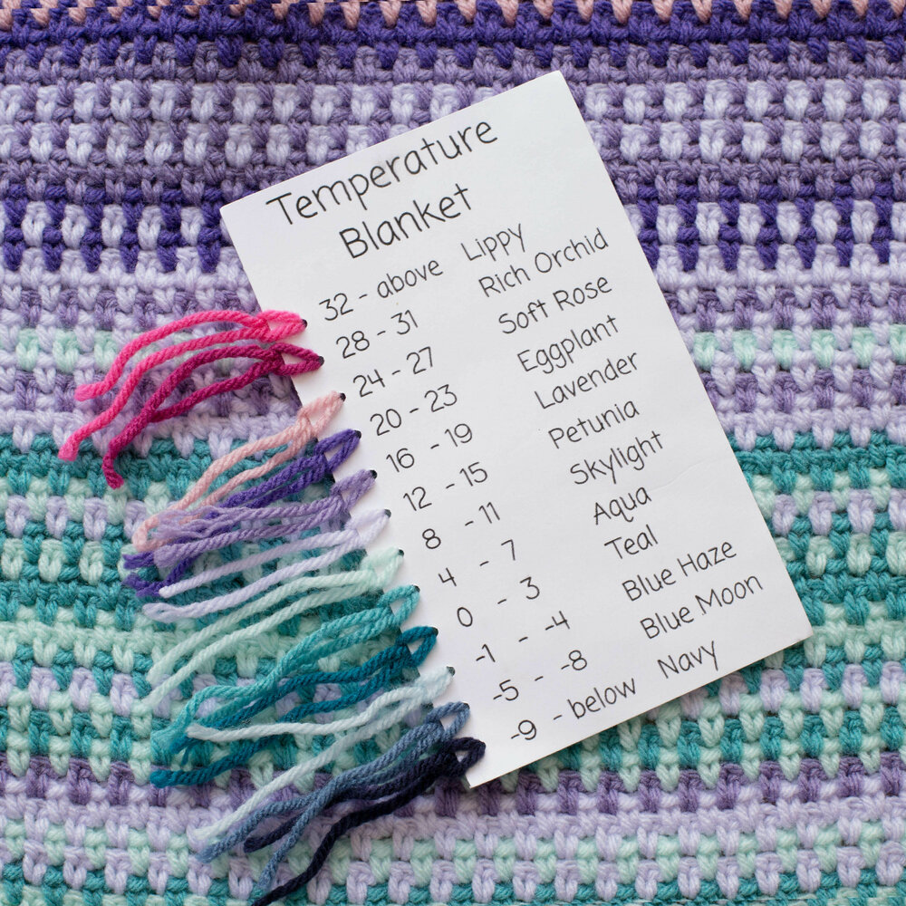

# knit-a-temperature-blanket

Generates a knitting pattern for a blanket with colours based on the recent temperature in your area. 



This is a [Next.js](https://nextjs.org/) project bootstrapped with [`create-next-app`](https://github.com/vercel/next.js/tree/canary/packages/create-next-app).

## Getting Started

First, run the development server:

```bash
npm run dev
# or
yarn dev
# or
pnpm dev
# or
bun dev
```

Open [http://localhost:3000](http://localhost:3000) with your browser to see the result.

You can start editing the page by modifying `app/page.tsx`. The page auto-updates as you edit the file.

This project uses [`next/font`](https://nextjs.org/docs/basic-features/font-optimization) to automatically optimize and load Inter, a custom Google Font.

## Learn More

To learn more about Next.js, take a look at the following resources:

- [Next.js Documentation](https://nextjs.org/docs) - learn about Next.js features and API.
- [Learn Next.js](https://nextjs.org/learn) - an interactive Next.js tutorial.

You can check out [the Next.js GitHub repository](https://github.com/vercel/next.js/) - your feedback and contributions are welcome!

## Deploy on Vercel

The easiest way to deploy your Next.js app is to use the [Vercel Platform](https://vercel.com/new?utm_medium=default-template&filter=next.js&utm_source=create-next-app&utm_campaign=create-next-app-readme) from the creators of Next.js.

Check out our [Next.js deployment documentation](https://nextjs.org/docs/deployment) for more details.

## To do

- [ ] CLI-based fixed calculator
- [ ] Create react front end to display fixed text results
- [ ] Host this front end for public access
- [ ] Key creator configuration
    - [ ] Allow users to enter their own colours
    - [ ] Allow users to enter their own temperature ranges
    - [ ] Allow users to enter their own location to fetch weather from
    - [ ] Allow users to enter their own stitches per row e.g. knit 1 row, purl 1 row.
- [ ] Display pattern result alongside pretty colour visualisation of blanket
- [ ] Make key creator a pretty visual experience i.e. UX to create the above pictured card key with yarn swatches.
- [ ] Export knitting pattern to print
- [ ] Share pattern with friends via URL
- [ ] Save selected config to local storage for users to return to and refresh later in the year
- [ ] Add line of previous progress e.g. already knitted january, just focus on pattern for feb - march.

## Resources

This project was built with NextJS following the following guides:
- Get started with TypeScript https://www.typescriptlang.org/download
- Created tsconfig using `npx tsc --help``
- Start a new React Project https://react.dev/learn/start-a-new-react-project
- Next JS App Router https://nextjs.org/docs/app#are-there-any-comprehensive-open-source-applications-built-on-the-app-router